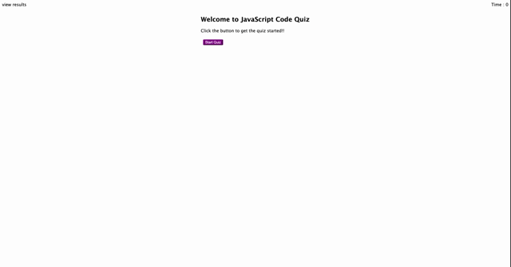

# Javascript Quiz!! 
This is a simple timed javacript quiz built using javascript and browser APIS. Using browser APIs created and manipulated HTML elements, added event listeners, created timers, stored and retrieved data into/from localStorage. 

# Tech Stack
- HTML
- CSS
- JavaScript (leveraging Browser APIs)

# Application Details
GH Repo @ https://github.com/rajeswarivmarimuthu/js-code-quiz
 
Deployed @ https://rajeswarivmarimuthu.github.io/js-code-quiz/

# A Short Demo of the Quiz

